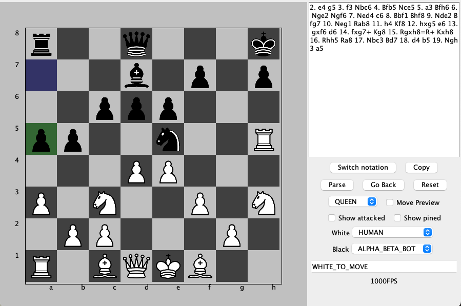

# Java Chess App

A complete Java chess engine including a GUI frontend, notation parsers and a simple Min/Max bots.
Created for my personal interest in chess and the computation behind it.

---

## Features
- ✅ **Complete chess rules**: legal move generation, check/checkmate/stalemate detection, castling, en passant, promotion, draw by repetition/50-move rule, etc.
- 🖥️ **Frontend**: Interactive board with move highlighting and history.
- 📝 **Notation parsing & exporting**: Algebraic and FEN import/export.
- 🤖 **Bots**: Simple Min/Max (depth-limited) AIs with pluggable evaluation heuristics.
- 🧪 **Tested core**: Unit tests for rules, parsing, and search.
- 🧱 **Modular design**: Engine, UI, and I/O separated into modules.